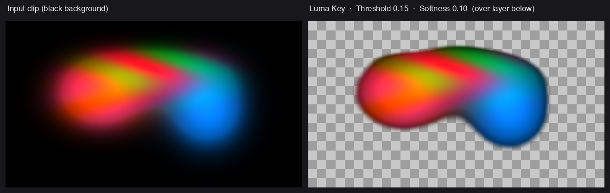

# Luma Key — Resolume FFGL plugin

A simple luminance keyer effect for [Resolume](https://resolume.com) Arena / Avenue,
built on the official [Resolume FFGL SDK](https://github.com/resolume/ffgl).

It measures the perceptual (Rec. 709) luminance of each pixel and drives that
pixel's alpha from it, so dark (or bright) areas of an incoming clip become
transparent and let lower layers show through — a quick way to key black
backgrounds, add-blend-style content, or shadow/highlight mattes without a
dedicated key colour.



*Rendered with the plugin's exact shader math (Rec. 709 luma → `smoothstep` key)
at the default Threshold 0.15 / Softness 0.10 — not a Resolume screen capture.*

## Try it in your browser

**<https://resolume-luma-keyer-demo.stoatworks-labs.com>**

Not the plugin — the GLSL from `source/LumaKey.cpp`, copied across unedited and run in
WebGL2 over clips generated in the page, with the parameters this plugin's
constructor declares and the conversions its own code applies. No install, and
nothing you load leaves your machine.

Drag Threshold and Softness over a few clips and watch the key move, with the transparency composited over a checkerboard so you can see exactly what is being taken out.

It is a port, so it is not evidence about the plugin: a browser is not Resolume,
GLSL ES 3.00 is not desktop GL 4.1 core, and nothing on that page measures
anything. The page says all of that itself, in a disclosure at the foot. The
numbers worth trusting are in [Status](#status) and come from the offline
harness in this repository.

<!-- downloads:start -->

## Download

**[v1.0.1](https://github.com/stoatworks-labs/resolume-luma-keyer/releases/tag/v1.0.1)** — prebuilt for macOS and Windows. Pick your platform:

<details>
<summary><b>macOS</b> — Universal (Apple Silicon + Intel)</summary>

| Build | Download | Size |
| --- | --- | --- |
| Universal (Apple Silicon + Intel) · .dmg disk image | [`luma-key-1.0.1-macos-universal.dmg`](https://github.com/stoatworks-labs/resolume-luma-keyer/releases/download/v1.0.1/luma-key-1.0.1-macos-universal.dmg) | 162 KB |
| Universal (Apple Silicon + Intel) · .zip archive | [`luma-key-macos-universal.zip`](https://github.com/stoatworks-labs/resolume-luma-keyer/releases/latest/download/luma-key-macos-universal.zip) | 126 KB |

</details>

<details>
<summary><b>Windows</b> — x64</summary>

| Build | Download | Size |
| --- | --- | --- |
| x64 · .exe installer | [`luma-key-1.0.1-windows-x86_64-setup.exe`](https://github.com/stoatworks-labs/resolume-luma-keyer/releases/download/v1.0.1/luma-key-1.0.1-windows-x86_64-setup.exe) | 201 KB |
| x64 · .zip archive | [`luma-key-windows-x86_64.zip`](https://github.com/stoatworks-labs/resolume-luma-keyer/releases/latest/download/luma-key-windows-x86_64.zip) | 94 KB |

</details>

All builds, checksums and release notes: [github.com/stoatworks-labs/resolume-luma-keyer/releases](https://github.com/stoatworks-labs/resolume-luma-keyer/releases).

These builds are unsigned, so macOS and Windows each warn once on first launch — see [Unsigned builds — macOS Gatekeeper & Windows SmartScreen](#unsigned-builds--macos-gatekeeper--windows-smartscreen) for the one-time fix.

<!-- downloads:end -->

## OpenFX — Resolve, Vegas, Nuke, Natron

The same effect also builds as an OpenFX plugin, so it runs in DaVinci Resolve
(Edit and Color pages, and Fusion), Vegas Pro, Nuke and Natron. It is
the same key, byte for byte — the CPU maths mirrors the GLSL and is tested against it.

Grab the `luma-key-ofx-*` zip for your platform from the release and copy
`LumaKey.ofx.bundle` into the standard OpenFX folder, then restart the host:

```
macOS    /Library/OFX/Plugins/
Windows  C:\Program Files\Common Files\OFX\Plugins\
```


## Parameters

| Parameter   | Type   | Default | Description |
|-------------|--------|---------|-------------|
| **Threshold** | 0–1 slider | 0.15 | Luma level at the centre of the key edge. Pixels darker than this are keyed out. |
| **Softness**  | 0–1 slider | 0.10 | Width of the soft edge around the threshold. `0` = a hard cut, higher = a gradual falloff. |
| **Invert**    | toggle | Off | Flip the key so that **bright** pixels are removed instead of dark ones. |

The effect works on straight (unpremultiplied) colour internally and outputs
premultiplied colour clamped to the LDR range, matching Resolume's pipeline, so
it composites cleanly with the layers beneath it.

## Requirements

- macOS with Xcode command-line tools (`clang`, `xcodebuild`)
- [CMake](https://cmake.org) 3.15+
- Resolume Arena/Avenue 7.3.1 or newer (this SDK's master branch)

## Build

The FFGL SDK is vendored as a git submodule, so clone recursively:

```sh
git clone --recursive <repo-url> resolume-luma-keyer
cd resolume-luma-keyer
# or, if you already cloned without --recursive:
git submodule update --init --recursive

cmake -S . -B build -DCMAKE_BUILD_TYPE=Release
cmake --build build
```

This produces a **universal** (arm64 + x86_64) `build/LumaKey.bundle`, which
loads in both native Apple-Silicon and Intel builds of Resolume.

For a faster single-arch development build:

```sh
cmake -S . -B build -DCMAKE_OSX_ARCHITECTURES=arm64 -DCMAKE_BUILD_TYPE=Release
cmake --build build
```

## Install

```sh
cmake --install build
```

By default this copies the bundle to:

```
~/Documents/Resolume Arena/Extra Effects/
```

Point it elsewhere (e.g. Avenue, or a shared location) with:

```sh
cmake --install build --prefix "$HOME/Documents/Resolume Avenue/Extra Effects"
```

Restart Resolume, then find **Luma Key** under the **Effects** panel (search
"Luma"). Drag it onto a clip or layer.

## Project layout

```
CMakeLists.txt          Top-level build: builds the SDK + this MODULE bundle
cmake/Info.plist.in     Bundle Info.plist template (CFBundlePackageType = BNDL)
source/LumaKey.h        Plugin class declaration
source/LumaKey.cpp      Plugin registration, GLSL shader, parameter handling
external/ffgl/          Resolume FFGL SDK (git submodule)
```

## How it works

`source/LumaKey.cpp` registers the plugin as an `FF_EFFECT` (unique ID `LK01`)
and carries a small GLSL fragment shader. Per pixel it:

1. Un-premultiplies the input colour.
2. Computes luminance `dot(rgb, vec3(0.2126, 0.7152, 0.0722))`.
3. Builds a soft key value with `smoothstep(Threshold ± Softness/2, luma)`.
4. Optionally inverts it, multiplies the existing alpha by the key, and
   re-premultiplies.

To change the plugin's name or ID, edit the `CFFGLPluginInfo PluginInfo(...)`
block near the top of `LumaKey.cpp` (the ID must be a unique 4-character string).

## Unsigned builds — macOS Gatekeeper & Windows SmartScreen

The released plugins are **not code-signed or notarized** — that needs paid Apple
and Microsoft developer certificates this project doesn't carry. On macOS this bites
harder than usual: a quarantined plugin makes your host **skip it or fail validation**
rather than show a friendly prompt.

- **macOS** — clear the quarantine flag after copying the bundle into place, then
  rescan plugins in your host:

  ```sh
  xattr -dr com.apple.quarantine "$HOME/Documents/Resolume Arena/Extra Effects/LumaKey.bundle"
  ```

- **Windows** — plugin files aren't gated the way `.exe` files are, so your host loads
  them normally. The **installer** trips SmartScreen: **More info** → **Run anyway**.

Per-artifact steps, self-signing and checksum verification:
**[docs/UNSIGNED.md](docs/UNSIGNED.md)**.

## Licence

MIT — see [LICENSE](LICENSE). The bundled FFGL SDK under `external/ffgl/` retains
its own Resolume licence — see `external/ffgl/LICENSE.md`.
